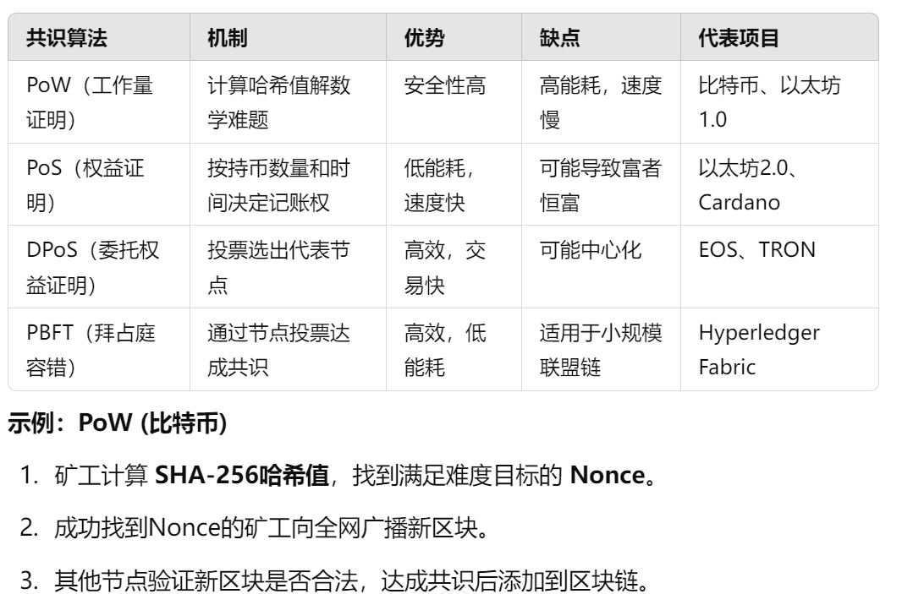
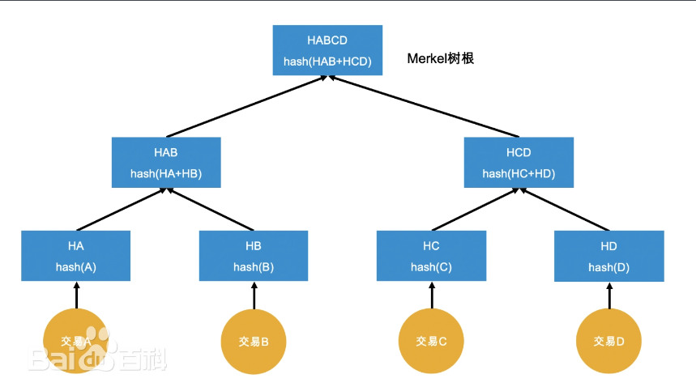

# 区块链（分布式账本技术）
区块链是一个由多个数据块组成的链式结构，每个区块都包含了一定数量的交易记录，并与前一个区块通过哈希值Hash进行链接，形成一条按时间顺序排列的“链”
## 核心特点
- 去中心化：分布式，所有节点都可以参与记账，数据由整个网络共同维护
- 不可篡改：每个区块都包含前一个区块的哈希值，一旦记录写入区块链，就很难被篡改，除非同时篡改整个链上的所有区块，这在实际操作上几乎不可能
- 透明：公开区块链（如比特币）允许任何人查看交易记录
- 安全：通过密码学（如哈希算法、非对称加密）、共识机制（如PoW、PoS）等技术，确保数据的安全性
***
注：共识机制是区块链中所有节点如何达成一致意见的规则

***
- 智能合约：一种自动执行的代码程序，可以在满足预设条件时自动执行交易或其他操作
## 基本结构
### 1.区块
区块是区块链的基本存储单位

#### (1).区块头
- 前一个区块的哈希值：保证区块链顺序
- 版本号：表示当前区块使用的区块结构格式和验证规则
- 时间戳：记录区块的创建时间
- 随机数（Nonce）：矿工在 PoW 挖矿中寻找的随机值，使得区块哈希小于难度目标
***
注：PoW挖矿：矿工通过计算哈希值解决数学难题，以获得记账权并获得区块奖励的过程。
***
- 难度：规定矿工需要计算的哈希值范围，决定 PoW 挖矿的难度。采用压缩表示法（bits 字段），而不是直接存储目标值。
- 默克尔树根：所有交易数据的哈希摘要，确保交易数据的完整性。通过默克尔树Merkle Tree计算得到
***
注：默克尔树（Merkle Tree）是一种 二叉哈希树，用于 验证数据完整性，广泛应用于 区块链、P2P网络、文件存储 等领域。

***
#### (2).区块体
存储具体的交易数据
## 交易流程
区块链交易的本质是将资产从一个账户转移到另一个账户，并记录在不可篡改的账本上。

以比特币为例，交易的全过程如下
### 1.交易创建
用户创建交易，以UTXO作为输入
***
注：UTXO 本质上是一笔交易的“找零”：
- 每次比特币交易，发送者必须消耗过去收到的 UTXO。
- 交易后，未使用的部分变成新的 UTXO，等待下次消费。

UTXO ≈ 现金零钱
你有一张 100 元纸币，买东西花了 30 元，商家找回 70 元。
100 元的纸币是旧的 UTXO，30 元被消费，70 元成为新的 UTXO。
***
指定接收者地址和金额，计算交易所需矿工费，生成交易原始数据
### 2.交易签名
用户使用私钥对交易谨慎性数字签名证明自己对该UTXO的所有权
### 3.交易广播
将已签名的交易发送到P2P网络，网络中的每个节点将验证交易合法性，存入交易池
### 4.矿工打包
矿工从交易池中选择手续费最高的交易（矿工优先打包高费用交易），计算默克尔根，生成区块头，开始PoW挖矿
### 5.交易确认
矿工找到合适的Nonce后，将新区块广播到全网，其他矿工节点验证区块正确性